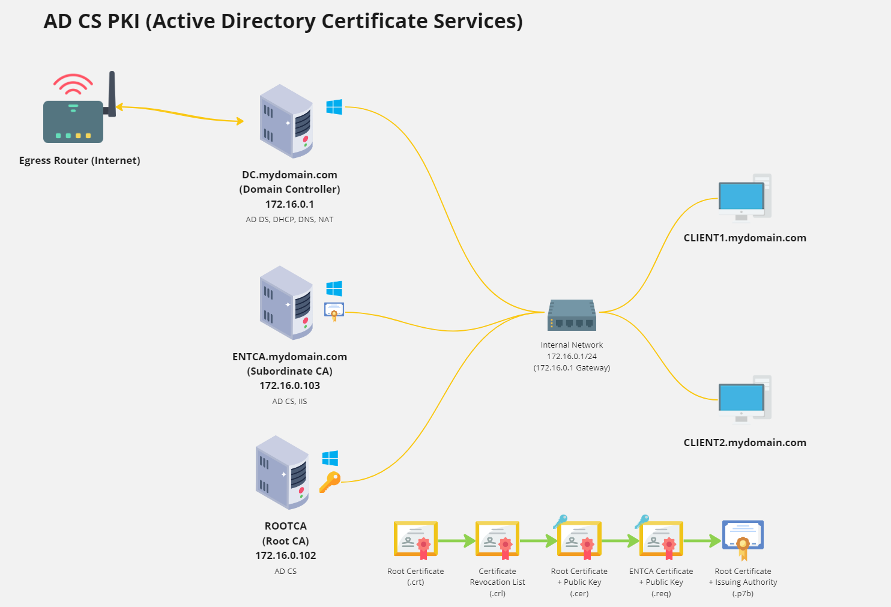

# Active Directory Domain Controller

Link to [diagram](https://miro.com/app/board/uXjVKfo6634=/?share_link_id=986471796522)

### Domain Controller - AD DS Setup

### PKI - AD CS Setup

## Summary

Implemented a robust network infrastructure comprising domain-joined machines utilizing <b>Server 2019</b> and <b>Windows 10</b>. Configured essential services including <b>Active Directory Domain Services (AD DS)</b>, <b>Active Directory Certificate Services (AD CS)</b> for <b>Public Key Infrastructure (PKI)</b>, <b>Dynamic Host Configuration Protocol (DHCP)</b>, <b>Domain Name System (DNS)</b>, and <b>Network Address Translation (NAT)</b>.   
Established hierarchy using <b>Tier (PAM)</b>, for granular access management and safeguard sensitive resources. Administered <b>Organizational Units (OUs)</b> and <b>Group Policy Objects (GPOs)</b> and enforced  configurations and policies across the network.   

